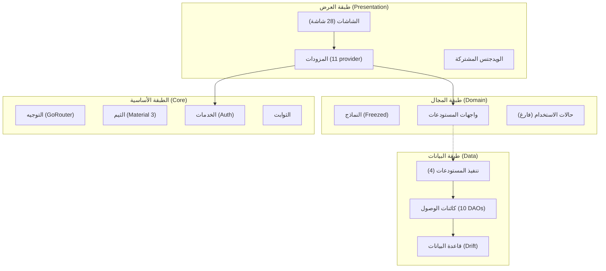
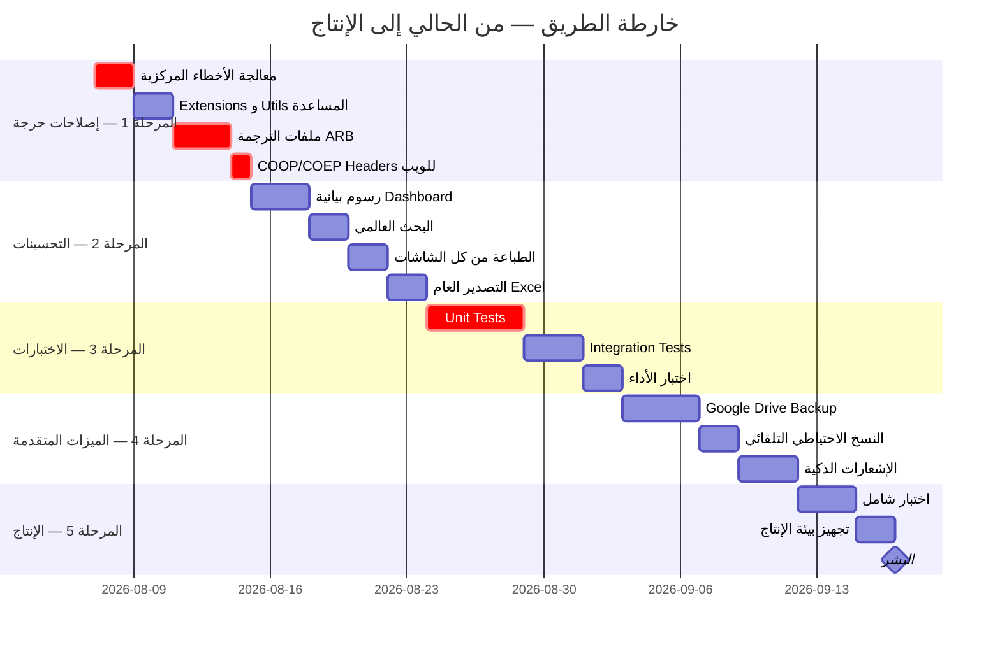

# 📊 تقرير الدراسة الشاملة — نظام إدارة المبيعات والخزينة (Sanad App)

> [!NOTE]
> تم فحص **كل ملف** في المشروع (90+ ملف مصدري) وتحليل البنية المعمارية والتقنية بالكامل.

---

## 🏗️ أولاً: نظرة عامة على المشروع

| البند | التفاصيل |
|---|---|
| **الاسم** | نظام إدارة المبيعات والخزينة (Sanad App) |
| **التقنية** | Flutter (Web + Android + iOS + Windows) |
| **قاعدة البيانات** | Drift (SQLite) — WASM على الويب، Native على الموبايل |
| **إدارة الحالة** | Riverpod 2.x مع Code Generation |
| **التنقل** | go_router مع Shell Routes + Auth Guard |
| **النماذج** | Freezed (Immutable) + json_serializable |
| **الأمان** | bcrypt (كلمات المرور) + AES-256-GCM (النسخ الاحتياطي) |
| **اللغات** | عربي (RTL افتراضي) + إنجليزي |
| **الإصدار** | v1.0.0+1 — Schema v2 |

---

## 🧱 ثانياً: البنية المعمارية (Clean Architecture)



---

## 📁 ثالثاً: هيكل الملفات الكامل

### قاعدة البيانات — 15 جدول + 1 View

| الجدول | الغرض | الحالة |
|---|---|---|
| `users` | المستخدمين (super_admin, admin, user) | ✅ مكتمل |
| `app_settings` | إعدادات التطبيق (مفتاح/قيمة) | ✅ مكتمل |
| `app_blobs` | الملفات الثنائية (شعار الشركة) | ✅ مكتمل |
| `fiscal_periods` | الفترات المالية (سنوية/ربع سنوية/شهرية) | ✅ مكتمل |
| `voucher_sequences` | العدادات الذرية لأرقام السندات | ✅ مكتمل |
| `treasuries` | الخزائن (رئيسية/مقاول/شريك) | ✅ مكتمل |
| `vouchers` | السندات (صرف/قبض/رصيد افتتاحي/تحويل) | ✅ مكتمل |
| `employees` | الموظفون | ✅ مكتمل |
| `cash_advances` | السلف النقدية | ✅ مكتمل |
| `cash_advance_repayments` | أقساط سداد السلف | ✅ مكتمل |
| `salary_payments` | دفعات الرواتب الشهرية | ✅ مكتمل |
| `contractors` | المقاولون | ✅ مكتمل |
| `partners` | الشركاء | ✅ مكتمل |
| `exchange_rates` | أسعار الصرف التاريخية | ✅ مكتمل |
| `audit_log` | سجل التدقيق | ✅ مكتمل |
| `v_treasury_balances` | **View** — أرصدة الخزائن المحسوبة | ✅ مكتمل |

### النماذج (Domain Models) — 12 نموذج Freezed

| النموذج | الحقول الرئيسية |
|---|---|
| `AuthState` | Sealed class — 6 حالات (Initial, Loading, Authenticated, Unauthenticated, Locked, Error) |
| `UserModel` | id, username, fullName, role, permissionsJson, failedLoginAttempts, lockedUntil |
| `TreasuryModel` | id, name, kind (main/contractor/partner), entityId, entityType |
| `TreasuryBalanceModel` | treasuryId, balanceIqd, balanceUsd, totalVouchers |
| `VoucherModel` | id, voucherNumber, voucherType (sarf/kabd/opening_balance/transfer), amount, currency (IQD/USD) |
| `AccountStatementModel` | voucher, runningBalanceIqd, runningBalanceUsd |
| `EmployeeModel` | id, fullName, phone, basicSalary, hireDate, treasuryId |
| `CashAdvanceModel` | id, debtorType, amount, currency, status, totalRepaid |
| `SalaryPaymentModel` | id, employeeId, periodLabel, basicSalary, additions, deductions, netAmount |
| `ContractorModel` | id, name, contractorType (individual/company), treasuryId |
| `PartnerModel` | id, name, sharePercentage, treasuryId |
| `FiscalPeriodModel` | id, name, periodType, startDate, endDate, status |

### الشاشات (Presentation) — 28 شاشة كاملة

| الميزة | الشاشات | الحالة |
|---|---|---|
| **المصادقة** | `SplashScreen`, `LoginScreen`, `FirstRunScreen` | ✅ مكتمل |
| **لوحة التحكم** | `DashboardScreen` (أرصدة، ملخص يومي، إجراءات سريعة) | ✅ مكتمل |
| **الخزائن** | `TreasuriesScreen` (عرض، فلترة، إنشاء، تعديل) | ✅ مكتمل |
| **السندات** | `VouchersListScreen`, `VoucherSarfScreen`, `VoucherKabdScreen`, `VoucherTransferScreen` | ✅ مكتمل |
| **الموظفون** | `EmployeesScreen` (إدارة + سلف + رواتب) | ✅ مكتمل |
| **المقاولون** | `ContractorsScreen` | ✅ مكتمل |
| **الشركاء** | `PartnersScreen` | ✅ مكتمل |
| **التقارير** | `ReportsScreen`, `AdvanceReportTab` | ✅ مكتمل |
| **الفترات المالية** | `FiscalScreen` (إغلاق، إعادة فتح، Cascade) | ✅ مكتمل |
| **النسخ الاحتياطي** | `BackupScreen` | ✅ مكتمل |
| **سجل التدقيق** | `AuditScreen` | ✅ مكتمل |
| **استيراد Excel** | `ExcelImportScreen` | ✅ مكتمل |
| **الإعدادات** | `SettingsScreen` + 8 تبويبات (مظهر، لغة، عملة، أمان، شركة، نسخ احتياطي، مستخدمون، معلومات النظام) | ✅ مكتمل |
| **الأخطاء** | `ErrorScreen` (404/403) | ✅ مكتمل |

---

## ✅ رابعاً: ما تم إنجازه (آخر ما قمتم به)

> [!IMPORTANT]
> المشروع في مرحلة **متقدمة جداً** — جميع الشاشات والميزات الأساسية مبنية بالكامل.

### الإنجازات المكتملة:

1. ✅ **البنية المعمارية الكاملة** — Clean Architecture مع 4 طبقات مفصولة
2. ✅ **قاعدة بيانات متقدمة** — 15 جدول + SQL View + 7 فهارس محسنة + Schema v2
3. ✅ **نظام مصادقة قوي** — bcrypt + Isolates + حماية Brute Force + قفل الحساب
4. ✅ **معالج الإعداد الأول** — First Run Wizard لتهيئة قاعدة البيانات والمدير
5. ✅ **إدارة الخزائن** — خزائن متعددة (رئيسية/مقاول/شريك) مع أرصدة محسوبة عبر SQL View
6. ✅ **نظام السندات الكامل** — صرف + قبض + رصيد افتتاحي + تحويل بين الخزائن (ذري)
7. ✅ **إدارة الموظفين** — CRUD + سلف نقدية + سداد أقساط + رواتب شهرية
8. ✅ **إدارة المقاولين** — أفراد/شركات مع خزائن مخصصة
9. ✅ **إدارة الشركاء** — نسب المشاركة + خزائن مخصصة
10. ✅ **الفترات المالية** — إنشاء/إغلاق/إعادة فتح مع Cascade Lock + Cascade Recompute
11. ✅ **استيراد Excel** — معالج 5 خطوات مع مطابقة الأعمدة ومعاينة مسبقة
12. ✅ **نظام التقارير** — تقارير PDF + كشف حساب + ملخص يومي + تقرير السلف
13. ✅ **النسخ الاحتياطي المحلي** — تشفير AES-256-GCM + ضغط gzip
14. ✅ **سجل التدقيق** — تسجيل كل العمليات مع diffs مضغوطة
15. ✅ **الثيم الديناميكي** — Material 3 مع 8 ألوان بذرة + فاتح/داكن/تلقائي
16. ✅ **دعم العملة المزدوجة** — دينار عراقي (IQD) + دولار أمريكي (USD) مع أسعار صرف تاريخية
17. ✅ **التنقل المتجاوب** — NavigationRail (ويب/تابلت) + NavigationBar (موبايل)

---

## ❌ خامساً: ما تبقى للإنجاز

### 🔴 مهام حرجة (مطلوبة للإنتاج)

| # | المهمة | الأولوية | التفاصيل |
|---|---|---|---|
| 1 | **ملفات الترجمة (.arb)** | 🔴 حرج | ملف `l10n.yaml` موجود لكن ملفات `.arb` الفعلية وتوليد `AppLocalizations` غير مكتمل — النصوص حالياً مكتوبة يدوياً بالعربي في الكود |
| 2 | **مجلد `core/errors/` فارغ** | 🔴 حرج | لا يوجد معالجة أخطاء مركزية — `AppException` sealed class مذكور في الخطة لكن الملف غير موجود |
| 3 | **مجلد `core/extensions/` فارغ** | 🟡 متوسط | Extensions مساعدة مذكورة في الخطة لكن غير مبنية |
| 4 | **مجلد `core/utils/` فارغ** | 🟡 متوسط | أدوات مساعدة (CurrencyFormatter, InputValidators, AuditLogger) مذكورة لكن غير موجودة |
| 5 | **مجلد `domain/usecases/` فارغ** | 🟡 متوسط | منطق الأعمال موزع على Providers بدلاً من Use Cases منفصلة — يقلل قابلية الاختبار |
| 6 | **مجلد `data/database/migrations/` فارغ** | 🟡 متوسط | الترقية من v1→v2 مكتوبة في `app_database.dart` لكن لا يوجد نظام migrations منظم |
| 7 | **الاختبارات** | 🔴 حرج | **صفر اختبارات** — لا unit tests ولا integration tests رغم وجود الـ dependencies |
| 8 | **النسخ الاحتياطي السحابي (Google Drive)** | 🟡 متوسط | Dependencies موجودة (`googleapis`, `google_sign_in`) لكن التنفيذ stub فقط |
| 9 | **COOP/COEP Headers للويب** | 🔴 حرج | مطلوبة لعمل OPFS SQLite على الويب — غير مُعدّة في ملفات الـ deployment |
| 10 | **رفع صورة المستخدم/شعار الشركة** | 🟡 متوسط | `image_picker` موجودة لكن التكامل الكامل غير واضح |

### 🟡 مهام تحسينية (مطلوبة لتجربة مستخدم ممتازة)

| # | المهمة | التفاصيل |
|---|---|---|
| 11 | **الرسوم البيانية في Dashboard** | `fl_chart` في الـ dependencies — تحتاج تكامل فعلي مع بيانات الخزائن |
| 12 | **النسخ الاحتياطي التلقائي** | جدولة نسخ احتياطي تلقائي (كل 6 ساعات أو بعد 50 سند) |
| 13 | **طباعة مباشرة من كل الشاشات** | خدمة PDF موجودة — تحتاج ربط مع أزرار الطباعة في كل شاشة |
| 14 | **تصدير Excel عام** | الاستيراد موجود لكن التصدير العام لكل الشاشات غير مكتمل |
| 15 | **إشعارات النظام** | غير مذكورة ولا موجودة |

---

## 💡 سادساً: اقتراحات وأفكار جديدة

### 🌟 اقتراحات لتحسين البرنامج الحالي

#### 1. 🛡️ معالجة الأخطاء المركزية
```
إنشاء core/errors/app_exception.dart مع sealed class يغطي:
- AuthException (فشل تسجيل الدخول)
- DatabaseException (أخطاء قاعدة البيانات)
- ValidationException (أخطاء التحقق)
- NetworkException (مشاكل الشبكة)
- PermissionException (صلاحيات غير كافية)
+ Error Boundary عام في التطبيق يلتقط الأخطاء غير المعالجة
```

#### 2. 📊 لوحة تحكم تفاعلية بالرسوم البيانية
```
- رسم بياني خطي لتتبع حركة الأرصدة عبر الأشهر
- رسم بياني دائري لتوزيع المصروفات حسب النوع
- رسم بياني شريطي لمقارنة الإيرادات والمصروفات
- مؤشرات KPI (إجمالي القبض، إجمالي الصرف، صافي الحركة)
```

#### 3. 🔍 بحث عالمي (Global Search)
```
- شريط بحث موحد في AppBar يبحث عبر كل الكيانات
- البحث في: السندات، الموظفين، المقاولين، الشركاء، الخزائن
- نتائج مجمعة مصنفة حسب النوع مع روابط سريعة
```

#### 4. 📱 إشعارات ذكية
```
- تنبيه عند انخفاض رصيد الخزينة عن حد معين
- تنبيه عند اقتراب موعد سداد سلفة
- تنبيه عند تجاوز حد المصروفات اليومية
- إشعار بالنسخ الاحتياطي المطلوب (مضى أكثر من X أيام)
```

#### 5. 📋 نظام التقارير المتقدم
```
- تقرير أرباح وخسائر شهري/سنوي
- تقرير مقارنة بين فترتين ماليتين
- تقرير حركة كل مقاول/شريك
- تقرير الرواتب الشهري مع خصومات السلف
- تقرير أعمار السلف المستحقة (Aging Report)
```

#### 6. 🔐 نظام الصلاحيات المُحسَّن
```
- لوحة صلاحيات مرئية (Matrix UI) بدلاً من JSON
- صلاحيات على مستوى الخزينة (مستخدم يرى خزينة معينة فقط)
- سجل تفصيلي لمحاولات الوصول المرفوضة
```

### 🚀 أفكار جديدة لإضافتها

#### 7. 📤 تصدير البيانات متعدد الصيغ
```
- تصدير CSV للاستخدام في برامج المحاسبة الأخرى
- تصدير PDF احترافي مع شعار الشركة
- تصدير Excel مع تنسيق جاهز ورسوم بيانية مضمنة
```

#### 8. 🔄 مزامنة متعددة الأجهزة
```
المرحلة 2 (Google Drive):
- نسخ احتياطي تلقائي مشفر
- استعادة من السحابة على أي جهاز

المرحلة 3 (Supabase):
- مزامنة فورية بين عدة مستخدمين
- حل تعارضات البيانات تلقائياً
```

#### 9. 🖨️ قوالب طباعة مخصصة
```
- سند قبض/صرف مع شعار الشركة
- كشف حساب رسمي مع ترويسة
- تقرير رواتب بالبصمة الرسمية
- إمكانية تخصيص القالب من الإعدادات
```

#### 10. 📊 مؤشرات الأداء (KPIs Dashboard)
```
- معدل المصروفات اليومية/الأسبوعية/الشهرية
- نسبة تحصيل السلف
- عدد السندات المنشأة يومياً
- مقارنة الأداء مع الفترات السابقة
```

#### 11. 🔒 نظام Offline-First المتقدم
```
- كاشيينغ ذكي لأهم البيانات
- مؤشر حالة الاتصال في واجهة المستخدم
- قائمة انتظار للعمليات المعلقة (Pending Sync Queue)
```

#### 12. 📝 ملاحظات وتعليقات على السندات
```
- إضافة ملاحظات/تعليقات على أي سند
- إمكانية إرفاق صور (فواتير، إيصالات) مع السندات
- نظام وسوم (Tags) لتصنيف السندات
```

---

## 🗺️ سابعاً: خارطة الطريق المقترحة للوصول لبرنامج جاهز وكامل



---

## 📈 ثامناً: تقييم جاهزية المشروع

| المعيار | التقييم | النسبة |
|---|---|---|
| البنية المعمارية | ⭐⭐⭐⭐⭐ ممتازة | 95% |
| قاعدة البيانات | ⭐⭐⭐⭐⭐ شاملة ومتقدمة | 98% |
| واجهة المستخدم | ⭐⭐⭐⭐⭐ كاملة وتفاعلية | 95% |
| منطق الأعمال | ⭐⭐⭐⭐ جيد جداً | 85% |
| الأمان | ⭐⭐⭐⭐ قوي | 85% |
| الاختبارات | ⭐ غير موجودة | 0% |
| التوثيق | ⭐⭐⭐⭐ خطة تنفيذ ممتازة | 80% |
| جاهزية الإنتاج | ⭐⭐⭐ تحتاج عمل | 70% |

### **التقييم الإجمالي: ~78% مكتمل**

> [!TIP]
> المشروع في مرحلة متقدمة جداً من حيث البنية والميزات. المطلوب الآن هو **إكمال الأجزاء الفارغة** (الأخطاء، الأدوات المساعدة، الاختبارات) ثم **تلميع التجربة** (رسوم بيانية، بحث عالمي، طباعة) للوصول لمنتج جاهز للاستخدام الفعلي.

---

## 🎯 تاسعاً: الخطوة التالية المقترحة

أقترح أن نبدأ بـ **المرحلة 1 (الإصلاحات الحرجة)** بالترتيب التالي:

1. **إنشاء `core/errors/app_exception.dart`** — معالجة أخطاء مركزية
2. **إنشاء `core/extensions/`** — Extensions مساعدة للـ BuildContext, Date, Number, String
3. **إنشاء `core/utils/`** — CurrencyFormatter, InputValidators, AuditLogger
4. **إعداد ملفات الترجمة `.arb`** — لدعم اللغتين بشكل صحيح
5. **إعداد COOP/COEP headers** — لدعم الويب بالكامل

> [!IMPORTANT]
> **ما هي الخطوة التي تريد أن نبدأ بها؟** يمكنني البدء فوراً في أي مهمة من القائمة أعلاه، أو يمكنك اقتراح ترتيب مختلف.

## ** ##

📖 دليل التشغيل الختامي للمشروع (Rule 6 — Running Guide)
إليك الدليل الكامل لتشغيل وبناء نظام إدارة المبيعات والخزينة (Sanad App):

1. متطلبات البيئة (Environment Prerequisites)
Flutter SDK: ≥ 3.22
Dart SDK: ≥ 3.4
المنصات المدعومة: Windows Desktop, Web, Android, iOS.
2. تثبيت الحزم وتوليد الكود (Setup & Build Dependencies)
في موجه الأوامر (Terminal) داخل مجلد sales_management:

bash

# 1. جلب الحزم والمكتبات
flutter pub get
# 2. توليد أكواد Drift و Freezed (إذا قمت بتعديل الجداول)
dart run build_runner build --delete-conflicting-outputs
3. تشغيل التطبيق في وضع التطوير (Running Locally)
bash

# تشغيل على Windows Desktop (المنصة الرئيسية)
flutter run -d windows
# تشغيل على المتصفح Web
flutter run -d chrome
4. تشغيل الاختبارات الآلية (Running Automated Tests)
bash

# تشغيل كليّة اختبارات الـ Unit Tests (43 اختباراً)
flutter test test/unit/
5. بناء النسخ الإنتاجية (Production Release Build)
bash

# بناء نسخة Windows التنفيذية (.exe)
flutter build windows --release
# بناء نسخة الويب (Web Release)
flutter build web --release
